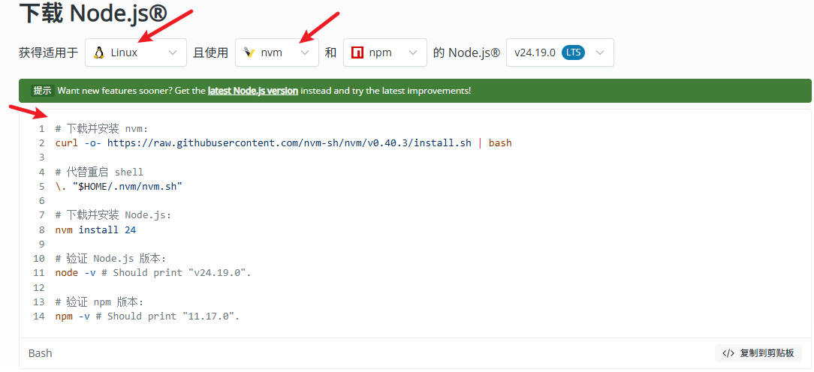
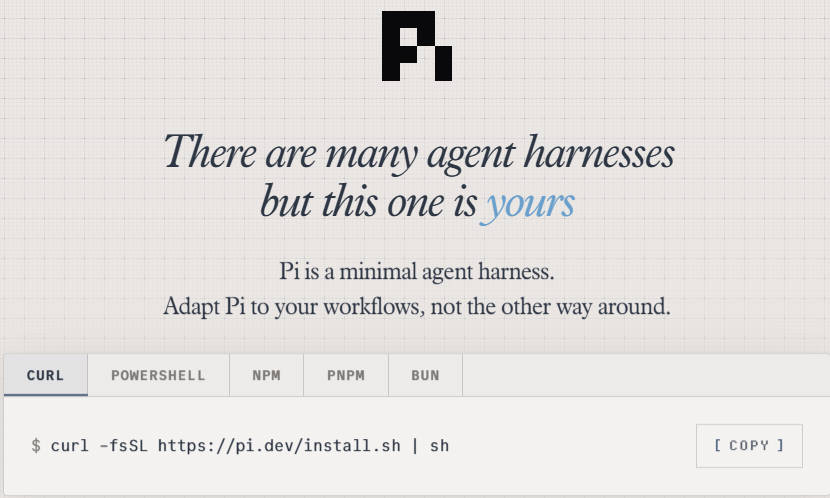
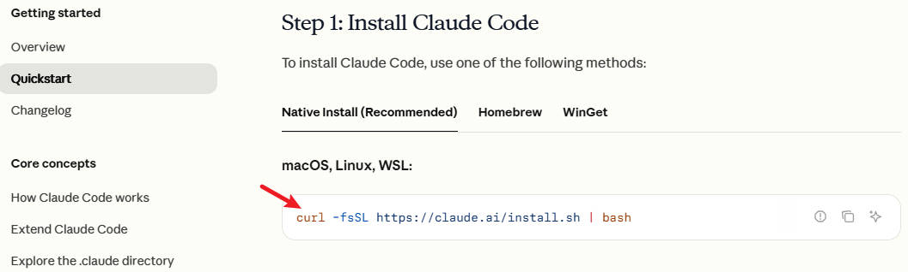
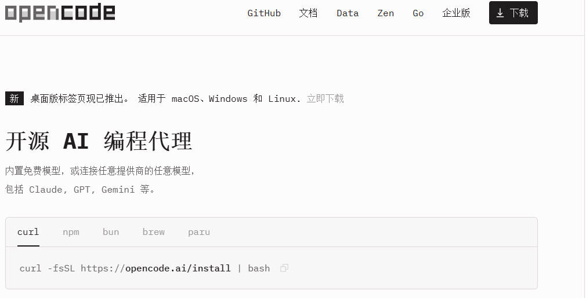

# WSL

WSL（Windows Subsystem for Linux）适用于Linux的Windows子系统，基于Hyper-V技术，运行多个带有GNU/Linux镜像的虚拟机。

## 一、安装

开启虚拟化/wsl --install --web-download(提高国内网络下载速度)/重启(或许需要)/wsl --update(把wsl本体功能升级到最新)/填写用户名和密码  

## 二、基础使用

|   命令     |       作用        |
|------------|------------------|
|wsl --update|把wsl本体功能升级到最新|
|wsl -l -o   |列出所有在线可安装的linux发行版(list online)  |
|wsl -l      |列出该电脑上安装过的所有linux虚拟机|
|wsl --install kali-linux --location D:\wsl\kali-linux|安装指定发行版到指定目录，kali-linux指定发行版，--location指定安装目录|
|wsl --install Ubuntu --name Ubuntu2|Ubuntu指定发行版安装实例，--name指定实例名|

|    启动      |       |
|-----------------|-------|
|wsl              | 启用默认虚拟机 |
|wsl -d kali-linux| 启动指定虚拟机 |
|powershell V 下拉窗口| 启动指定虚拟机 |
|wsl --set-default kali-linux|设置默认虚拟机|
|exit             |退出虚拟机|
|关闭命令行窗口    |关闭虚拟机|

## 三、安装Agent

### （一）安装三件套

运行Agent之前一般需要安装开发三件套NodeJS、Git、Python，安装之前查看是否已经安装  

`git -v`  #查看git版本  
`python3 --version、python --version` #查看python版本  
`node -v` #查看nodejs版本  

1. 安装python  
``python3 --version/python --version/sudo apt update/sudo apt install python-is-python3/python --version``  
python --version 返回版本号则无需后面命令  

2. 安装node  
``node -v``/[nodejs官网](https://nodejs.org/zh-cn/download)选择linux nvm 复制所有命令

d
### （二）安装Agent

1. 进入主目录，创建文件夹  
``cd/mkdir pi_test/cd pi_test``  
2. 安装模型  
复制curl命令复制粘贴后重启  
[Pi](https://pi.dev/)  
  
[ClaudeCode](https://code.claude.com/docs/en/quickstart#step-1-install-claude-code)  
  
[OpenCode](https://opencode.ai/)  
  
3. 创建API key  
模型官网([deepseek](https://platform.deepseek.com/))创建API key
4. 配置模型  
PI：``/login/use an API key/选择模型/复制API key粘贴回车``  
5. 切换模型  
``/model``
6. 检测是否配置成功  
你好打招呼返回结果→配置成功

nvm(node version manager) linux上最推荐node版本管理软件  
sudo = super user do 以管理员身份运行命令  
apt 是Ubuntu软件管理工具  
sudo apt update 更新apt索引  
clear 清理屏幕  
~ 用户主目录，即/home/{用户名}  
code . 使用VS code打开当前工作目录  
wsl实例的文件都可以用windows资源管理器打开并修改  
df -h 查看linux所有磁盘，wsl中windows上所有磁盘皆以挂载卷形式出现在linux目录里面(C→/mnt/C)  
注意：wsl里面开发项目时，项目文件尽量放在linux的原生目录里面，不要放在windows的目录里面。

## 四、Docker

命令：[Docker](https://get.docker.com/)网站执行Usage下的第1步和第4步  
安装redis实例：sudo docker run -d -p 6379:4379 redis  
sudo docker ps -a  
sudo docker start 容器ID  

## 五、显卡直通

## 六、图形界面

## 七、WSL网络

## 八、备份与克隆
